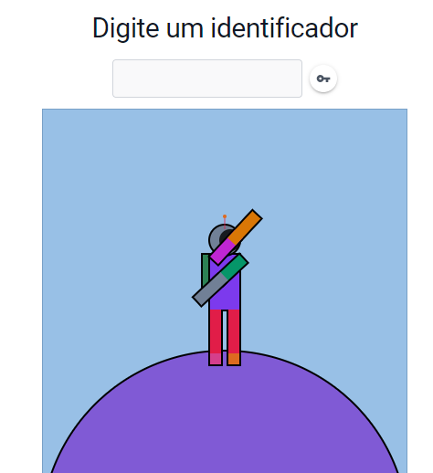

## Integrantes: 
Fernando Su Jia Jie - 821162482<br>
Rodrigo da Silva Lima - 821143276<br>
Henricky Corazza Serrão - 821147310<br>
Breno Navarro Sgarbi - 821140632<br>
Gabriel Amaral Duarte - 821138535<br>

## Como rodar?

Clone ou faça o download deste repositório. Acesse a pasta, instale as dependências e execute-o com `npm run dev`  

```bash
cd svguid
npm install
npm run dev
```

Abra o navegador e acesse a url: `http://localhost:5173/`



Cada identificador digitado irá gerar uma chave hash que poderá ser visualizada a partir do botão ao lado.


## Como criar um algoritmo para gerar avatar?

🧑‍💻 Na pasta `src/widget/` você irá encontrar um arquivo `widget.js`. Este arquivo exporta uma função que será executada toda vez que o identificador é atualizado. Esta função receberá dois parâmetros `(key, draw)` que representa respectiamente: 

> `key`: um objeto pelo qual você poderá acessar o hash gerado a partir do identificador digitado (ver mais explicações abaixo)
> `draw`: um objeto da biblioteca `svg.js` que disponibiliza métodos que facilitam a criação da imagem vetorial. (ver mais explicações abaixo)  

### Sobre o parâmetro `key`

Como queremos que as imagens sejam únicas e sempre a mesma para cada identificador, em vez de usar algo aleatório, iremos usar o objeto `key`:

Métodos:
> `key.next()`: retorna um inteiro entre 1 a 1000 
> `key.next256()`: retorna um inteiro entre 0 a 255 
> `key.next16()`: retorna um inteiro entre 0 a 15 

### Sobre o parâmetro `draw`

É um objeto da biblioteca `svg.js` que disponibiliza métodos que facilitam a criação da imagem vetorial:

Métodos:
> `draw.rect()`: **desenha um retângulo**
> `draw.rect().size(width, height)`: define largura e altura
> `draw.rect().move(x, y)`: posiciona o canto superior esquerdo do retângulo
> `draw.rect().fill(color)`: preenche retângulo com a cor `color`

> `draw.circle()`: **desenha um circulo**
> `draw.circle().size(radius)`: define o raio do círculo
> `draw.circle().move(x, y)`: posiciona o canto superior esquerdo do circulo
> `draw.circle().fill(color)`: preenche círculo com a cor `color`

Disponibiliza uma função `getColorIterator` que devolve um iterador de cores.

~~~javascript 
import { getColorIterator } from "../utils/colors/color.js"
~~~

~~~javascript 
let nextColor = getColorIterator(key)
// a cada chamada do iterador nextColor() devolve uma cor diferente 
nextColor()
~~~

